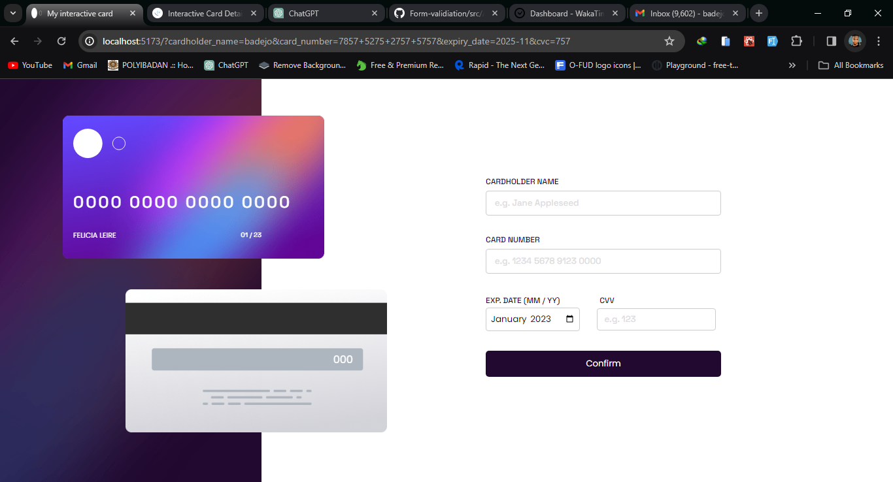

# Frontend Mentor - Interactive card details form solution

## Overview

### Screenshot

### Links

- Solution URL: 
- Live Site URL: https://interactive-card-validation.vercel.app/)

## My process
Went through series of contemplation in choosong between desktop views but got to choose one later and i designed the whole interface before moving to write the logics.

## bult with
- [React](https://reactjs.org/) - JS library

### What I learned

i learnt how to make use of the input tag for different data and most importantly i found a new way to display errors using the toast toastify library in react and positioning the notification.
and i also improved in making use of useState and passing props to functions.

### Useful resources

MDN web docs was really an insighful resource to use in web developmen.(https://developer.mozilla.org/en-US/docs/Web/HTML/Element/input/date)

## Author

- Website - [sammy](https://my-portfolio-three-phi-24.vercel.app/)
- Frontend Mentor - [sammyfrosh](https://www.frontendmentor.io/profile/yourusername)
- Twitter - [@var sammy](https://www.twitter.com/sammypipz)